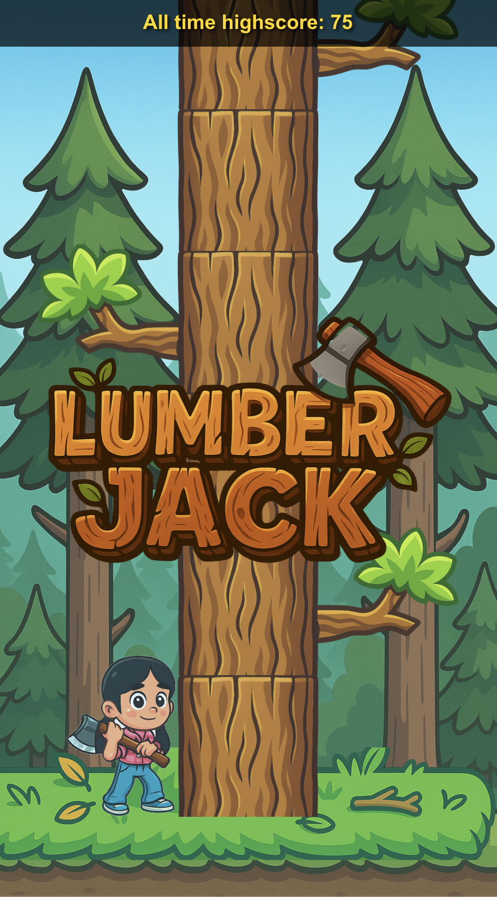

# Lumberjack2

A modern React-based lumberjack game built with Vite, TypeScript, and comprehensive testing.



## Quick Start

```bash
# Install dependencies
npm install

# Start development server
npm run dev

# Run tests
npm test
```

## Development

### Tech Stack
- **React 19** - Modern React with concurrent features
- **TypeScript** - Strict type checking with React JSX support
- **Vite** - Fast build tool with HMR and ESM support
- **Vitest** - Jest-compatible testing framework
- **React Testing Library** - Component testing utilities
- **Playwright** - End-to-end testing framework
- **ESLint** - Code quality with React/TypeScript presets

### Available Scripts

| Command | Description |
|---------|-------------|
| `npm run dev` | Start development server with hot reload |
| `npm run build` | Lint, TypeScript check, and production build |
| `npm run preview` | Preview production build locally |
| `npm run lint` | Run ESLint code quality checks |
| `npm run lint:fix` | Auto-fix ESLint issues |
| `npm test` | Run all unit/integration tests once |
| `npm run test:watch` | Run unit/integration tests in watch mode |
| `npm run test:coverage` | Run unit/integration tests with coverage report |
| `npm run test:e2e` | Run Playwright end-to-end tests (non-interactive) |
| `npm run test:e2e:ui` | Run Playwright tests with interactive UI |
| `npm run test:e2e:html` | Run Playwright tests with HTML report |

### Project Architecture

```
src/
├── main.tsx              # React app entry point
├── App.tsx              # Main app component
├── components/
│   ├── SceneManager.tsx # Scene-based architecture controller
│   ├── scenes/          # Game screens (Attract, Play, GameOver)
│   └── ...             # Reusable UI components
├── game/               # Pure game logic (no React dependencies)
├── hooks/              # Custom React hooks
└── __tests__/          # Integration tests
tests/
└── e2e/                # Playwright end-to-end tests
```

### Development Patterns

- **Scene-Based Architecture**: Professional game flow with Attract/Play/GameOver screens
- **Modular Game Logic**: Pure functions separated from React components
- **Custom Hooks**: Encapsulated state and side effects (`useGameState`, `useKeyboardInput`)
- **Comprehensive Testing**: Unit, component, integration, and end-to-end tests
- **Type Safety**: Strict TypeScript configuration with React JSX transform

### Testing Strategy

#### Unit & Integration Tests (Vitest + React Testing Library)
- **Unit Tests**: Pure functions in `src/game/` - collision detection, scoring, tree generation
- **Component Tests**: UI components with user-centric queries and accessibility testing
- **Hook Tests**: Custom hooks behavior testing with `@testing-library/react-hooks`
- **Integration Tests**: Complete user workflows testing scene transitions and game flow
- **Coverage**: Run `npm run test:coverage` for detailed reports

Tests are co-located with source files using `.test.tsx` suffix.

#### End-to-End Tests (Playwright)
- **Scene Flow Testing**: Complete navigation through Attract → Play → GameOver screens
- **High Score Persistence**: LocalStorage integration and score tracking across sessions
- **User Interaction Testing**: Keyboard input, game mechanics, and collision detection
- **Auto-Return Features**: Timed transitions and countdown functionality
- **Cross-Browser Testing**: Automated testing in Chromium, Firefox, and Safari

#### Test Execution

```bash
# Run all unit/integration tests
npm test

# Run tests in watch mode (recommended for development)
npm run test:watch

# Run tests with coverage report
npm run test:coverage

# Run end-to-end tests (requires dev server)
npm run test:e2e

# Run E2E tests with interactive UI
npm run test:e2e:ui

# Run E2E tests with HTML report
npm run test:e2e:html
```

#### Special Testing Features
- **Deterministic Test Mode**: Add `?testMode=true` to URL for predictable game behavior in E2E tests
- **Debug Mode**: Press `?` key in game to view internal state and collision detection
- **Accessibility Testing**: All components tested with screen readers and keyboard navigation

### Code Quality

- ESLint v9 flat configuration with React and accessibility rules
- TypeScript strict mode with additional linting
- Automated formatting and quality checks on build

## Contributing

### Development Workflow
1. **Install dependencies**: `npm install`
2. **Start dev server**: `npm run dev`
3. **Run tests during development**: `npm run test:watch`

### Before Committing
1. **Run all tests**: `npm test` and `npm run test:e2e`
2. **Check code quality**: `npm run lint`
3. **Verify TypeScript compilation**: `npm run build`
4. **Check test coverage**: `npm run test:coverage`

### Testing Requirements
- Unit tests must pass with >90% coverage
- All E2E tests must pass (some are currently failing - see [known issues](PROGRESS.md))
- New features require corresponding test coverage
- UI changes must include accessibility testing

The project uses modern ESM-only configuration and requires Node.js with ES2022 support.

## Game Features

- **Scene-Based Navigation**: Professional game flow with attract screen, gameplay, and game over
- **Score Persistence**: High scores saved to localStorage across sessions
- **Collision Detection**: Real-time branch collision with immediate game over
- **Debug Mode**: Press `?` to view game state, player position, and tree segments
- **Keyboard Controls**: Arrow keys for chopping, `?` for debug, `r` for reset
- **Auto-Return**: Game over screen automatically returns to attract after 5 seconds
- **Responsive Design**: Works on desktop and mobile devices

## Known Issues

- 4/5 Playwright E2E tests currently fail due to timing/deterministic issues
- See [PROGRESS.md](PROGRESS.md) for detailed development status and debugging information